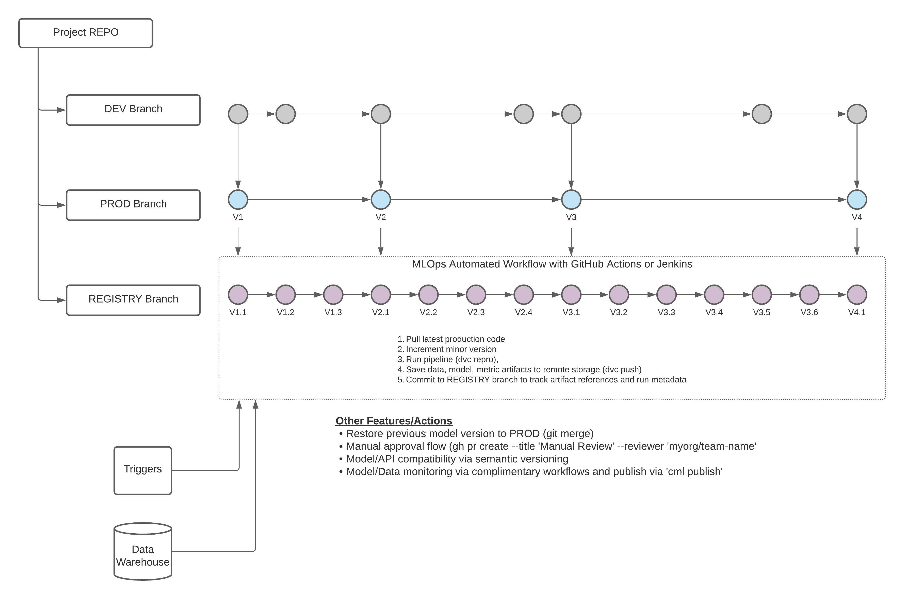

# Git-DVC Based Model Registry Concept

## Overview

This project is intended to explore the feasibility of using a combination of simple Git and DVC to build a functional model repository.

This could provide a simple integrated solution for an essential MLOps component without requring the need of additional software/infastructure.


## Proposed Process & Architecture




## Setup

### Dependencies

In order to run the code, you must first install the project dependencies using the `packrat` package.

```
install.packages("packrat")
packrat::restore()
```

Additionally, you will need to have [Data Version Control](https://dvc.org/) (DVC) installed on your machine. DVC is used for tracking/managing large files (e.g. data, models) in external storage (e.g. S3, Local, etc.). See the basic setup commands below:

```
dvc repro                          # runs the modeling pipeline DAG
dvc remote add -d myremote <path>  # sets your personal remote storage
dvc install                        # configures githooks to facilitate workflows

```

## Repo Structure

```
Project Directory
│
│   .dvcignore
│   .gitignore
│   .Rprofile
│   dvc.lock
│   dvc.yaml
│   mlops-model-registry-concept.Rproj
│   params.yaml
│   README.md
│
├───.dvc
│       .gitignore
│       config
│
├───.images
│       architecture.jpeg
│
├───code
│       01_prepare.R
│       02_train.R
│
├───data
│   ├───processed
│   │       .gitignore
│   │
│   └───raw
│           iris.csv
│
├───out
│   ├───metrics
│   │       .gitignore
│   │
│   └───models
│           .gitignore
│
└───packrat
        init.R
        packrat.lock
        packrat.opts
```
